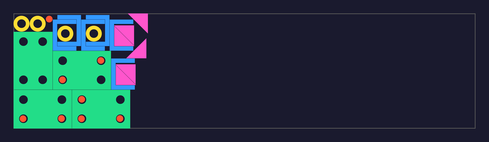
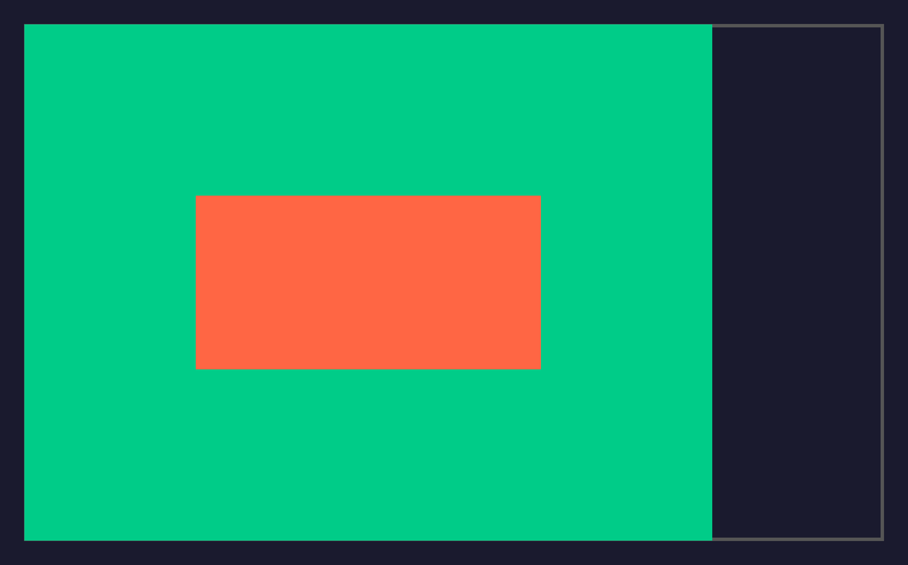
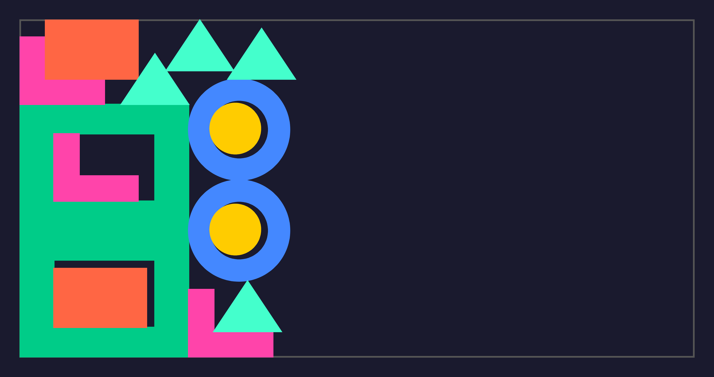

# pyckingsolver

**Shapely-based Python interface for [PackingSolver](https://github.com/fontanf/packingsolver) — 2D irregular bin packing & nesting.**

[](https://pypi.org/project/pyckingsolver/)
[](https://pypi.org/project/pyckingsolver/)
[](LICENSE)
[](https://github.com/HamzaYslmn/pyckingsolver/actions)

Pack irregular shapes into bins — rectangles, circles, arbitrary polygons with holes.
Built for **CNC laser cutting**, sheet metal nesting, fabric cutting, and any 2D packing problem.

<p align="center">
  
  <br/><em>Laser cutting layout: mounting plates with bolt holes, washers, U-brackets, discs &amp; gussets</em>
</p>

---

## Install

```bash
pip install pyckingsolver
```

The C++ solver binary is **bundled** — no compilation needed on Windows x64 and Linux x64.

> For other platforms, build the solver from the included submodule. See [Building the Solver](#building-the-solver).

---

## Gallery

| Hole Fill | Custom Holes & Rings | Metal Cutting |
|:-:|:-:|:-:|
|  |  |  |
| Filler placed inside frame hole | Frames, rings, discs & triangles | Plates, washers, brackets & gussets |

---

## Quick Start

```python
from shapely.geometry import Polygon, Point
from pyckingsolver import InstanceBuilder, Objective, Solver

b = InstanceBuilder(Objective.OPEN_DIMENSION_X)
b.add_bin_type_rectangle(1200, 600)
b.add_item_type_rectangle(80, 60, copies=10)
b.add_item_type(Polygon([(0,0),(50,0),(25,40)]), copies=6)

solver = Solver()  # auto-finds bundled binary
solution = solver.solve(b.build(), time_limit=30)

print(f"{solution.total_item_count()} items in {solution.total_bins_used()} bins")

for item in solution.all_items():
    print(item.item_type_id, item.angle, item.shapes[0].bounds)
```

---

## Objectives

Choose what the solver optimizes:

| Objective | Use Case |
|-----------|----------|
| `OPEN_DIMENSION_X` | Minimize strip **width** — items pack left-to-right (laser cutting rolls) |
| `OPEN_DIMENSION_Y` | Minimize strip **height** |
| `OPEN_DIMENSION_XY` | Minimize both dimensions (compact 2D nesting) |
| `BIN_PACKING` | Use **fewest bins** — fixed-size sheets |
| `KNAPSACK` | Maximize **value** of items in one bin |
| `VARIABLE_SIZED_BIN_PACKING` | Multiple bin sizes with costs — minimize total cost |
| `BIN_PACKING_WITH_LEFTOVERS` | Bin packing that tracks **reusable scrap** |
| `DEFAULT` | Let the solver pick the best objective |
| `OPEN_DIMENSION_Z` | Minimize the Z dimension (3D problems) |

All C++ naming conventions are accepted — kebab-case, PascalCase, and abbreviations:

```python
Objective("bin-packing")             # kebab-case (canonical)
Objective("BinPacking")              # PascalCase
Objective("BPP")                     # abbreviation
Objective("BinPackingWithLeftovers")  # PascalCase
Objective("BPPL")                    # abbreviation
```

```python
from pyckingsolver import Objective

b = InstanceBuilder(Objective.BIN_PACKING)
```

---

## InstanceBuilder

### Bins

```python
b = InstanceBuilder(Objective.BIN_PACKING)

# Rectangle bin
b.add_bin_type_rectangle(1200, 600, copies=10, cost=1.0)

# Circle bin
b.add_bin_type_circle(radius=300, resolution=64)

# Any Shapely polygon
b.add_bin_type(Polygon([...]))

# With edge clearance (e.g. clamp margin)
b.add_bin_type_rectangle(1200, 600, item_bin_minimum_spacing=5.0)

# Multiple bin types (variable-sized bin packing)
small_id = b.add_bin_type_rectangle(600, 400, cost=1.0, copies=5)
large_id = b.add_bin_type_rectangle(1200, 800, cost=1.8, copies=3)
```

### Items

```python
# Rectangle item
b.add_item_type_rectangle(80, 60, copies=4)

# Any Shapely polygon
b.add_item_type(Polygon([(0,0),(100,0),(50,80)]), copies=6)

# Polygon with interior hole (e.g. washer, frame)
washer = Point(0,0).buffer(30).difference(Point(0,0).buffer(15))
b.add_item_type(washer, copies=4)

# With profit (for knapsack)
b.add_item_type(polygon, copies=3, profit=42.0)

# Multiple shapes per item (composite/multi-part item)
b.add_item_type([shape_a, shape_b], copies=2)
```

### Rotations

```python
# Fixed (no rotation) — default
b.add_item_type(shape, allowed_rotations=[(0, 0)])

# 90° increments
b.add_item_type(shape, allowed_rotations=[(0,0),(90,90),(180,180),(270,270)])

# Any custom discrete angles
b.add_item_type(shape, allowed_rotations=[(0,0),(45,45),(90,90)])

# Free continuous rotation
b.add_item_type(shape, allowed_rotations=[(0, 360)])

# Mirroring
b.add_item_type(shape, allow_mirroring=True)
```

### Spacing

```python
# Minimum gap between all items (e.g. 2mm laser kerf)
b.set_item_item_minimum_spacing(2.0)

# Clearance from bin edges (per bin type)
b.add_bin_type_rectangle(1200, 600, item_bin_minimum_spacing=5.0)
```

### Defects

Defects are no-go zones inside a bin (scratches, holes, clamps):

```python
bin_id = b.add_bin_type_rectangle(1200, 600)

# Add a defect (no item may overlap it)
scratch = Polygon([(100,100),(200,100),(200,150),(100,150)])
b.add_defect(bin_id, scratch)

# With clearance around defect
b.add_defect(bin_id, scratch, item_defect_minimum_spacing=3.0)

# With defect type label
b.add_defect(bin_id, scratch, defect_type=1)
```

### Quality Rules

Restrict certain items to certain zones of the bin:

```python
b.add_quality_rule([0, 1])        # items with quality_rule=0 can go on areas 0 or 1
b.add_item_type(shape, copies=2)  # quality_rule=-1 = no restriction (default)
```

### Aspect Ratio (Open Dimension XY)

```python
b = InstanceBuilder(Objective.OPEN_DIMENSION_XY)
b.set_open_dimension_xy_aspect_ratio(1.5)  # enforce width/height <= 1.5
```

### Leftover Corner

For `BIN_PACKING_WITH_LEFTOVERS`, set the reference corner for scrap:

```python
from pyckingsolver import Corner

b.set_leftover_corner(Corner.BOTTOM_LEFT)   # default
b.set_leftover_corner(Corner.TOP_RIGHT)
```

Corners accept all C++ naming formats:

```python
Corner("BottomLeft")    # PascalCase (canonical)
Corner("bl")            # abbreviation
Corner("bottom-left")   # kebab-case
```

---

## Use Cases

### Laser Cutting / Sheet Metal Nesting

Minimize material usage from a fixed sheet with kerf spacing:

```python
from shapely.geometry import Polygon, Point
from pyckingsolver import InstanceBuilder, Objective, Solver

b = InstanceBuilder(Objective.BIN_PACKING)
b.set_item_item_minimum_spacing(2.0)        # 2mm laser kerf
b.add_bin_type_rectangle(1200, 600, copies=100)

# Mounting plate with bolt holes
plate = Polygon([(0,0),(150,0),(150,100),(0,100)])
for cx, cy in [(25,25),(125,25),(25,75),(125,75)]:
    plate = plate.difference(Point(cx,cy).buffer(12, resolution=16))
b.add_item_type(plate, copies=8,
                allowed_rotations=[(0,0),(90,90),(180,180),(270,270)])

# Discs that nest inside the bolt holes
b.add_item_type(Point(0,0).buffer(8, resolution=16), copies=16)

# L-bracket
b.add_item_type(
    Polygon([(0,0),(80,0),(80,60),(70,60),(70,10),(10,10),(10,60),(0,60)]),
    copies=12, allowed_rotations=[(0,0),(90,90),(180,180),(270,270)])

solution = Solver().solve(b.build(), time_limit=60)
print(f"{solution.total_item_count()} parts in {solution.total_bins_used()} sheets")
```

### Roll / Strip Cutting

Minimize roll length consumed:

```python
b = InstanceBuilder(Objective.OPEN_DIMENSION_X)
b.set_item_item_minimum_spacing(1.5)
b.add_bin_type_rectangle(99999, 1200)   # very long, fixed width

b.add_item_type(shape_a, copies=20, allowed_rotations=[(0, 360)])
b.add_item_type(shape_b, copies=15, allowed_rotations=[(0, 360)])

solution = Solver().solve(b.build(), time_limit=30)
used_length = max(item.x + item.shapes[0].bounds[2]
                  for item in solution.all_items())
print(f"Roll used: {used_length:.1f} mm")
```

### Knapsack / Value Maximization

Pack as much value as possible in one bin:

```python
b = InstanceBuilder(Objective.KNAPSACK)
b.add_bin_type_rectangle(500, 300)

shapes_with_values = [
    (Polygon([...]), 10.0),
    (Polygon([...]), 25.0),
]
for shape, profit in shapes_with_values:
    b.add_item_type(shape, copies=5, profit=profit)

solution = Solver().solve(b.build(), time_limit=30)
total_profit = sum(
    instance.item_types[item.item_type_id].profit
    for item in solution.all_items()
)
```

### Variable-Sized Bin Packing

Choose from multiple sheet sizes to minimize cost:

```python
b = InstanceBuilder(Objective.VARIABLE_SIZED_BIN_PACKING)
b.add_bin_type_rectangle(600, 400, cost=1.0, copies=10)
b.add_bin_type_rectangle(1200, 800, cost=1.8, copies=5)

for shape in my_parts:
    b.add_item_type(shape, copies=2)

solution = Solver().solve(b.build(), time_limit=60)
```

### Defective Sheet Handling

Avoid defective zones on material:

```python
b = InstanceBuilder(Objective.BIN_PACKING)
bin_id = b.add_bin_type_rectangle(1200, 600)

# Scratch at center — no item within 3mm
scratch = Point(600,300).buffer(40)
b.add_defect(bin_id, scratch, item_defect_minimum_spacing=3.0)

# Clamped edges — keep items 10mm from edges
b.add_bin_type_rectangle(1200, 600, item_bin_minimum_spacing=10.0)
```

### Arbitrary Polygon Bins

Non-rectangular cutting areas (e.g., round table, irregular offcut):

```python
# Circular bin
b.add_bin_type_circle(radius=500)

# Hexagonal bin
import math
hex_pts = [(500*math.cos(math.pi/3*i), 500*math.sin(math.pi/3*i)) for i in range(6)]
b.add_bin_type(Polygon(hex_pts))

# Irregular offcut
offcut = Polygon([(0,0),(800,0),(800,300),(500,600),(0,600)])
b.add_bin_type(offcut)
```

---

## Solver

```python
from pyckingsolver import Solver, Corner

# Auto-discover bundled binary
solver = Solver()

# Explicit binary path
solver = Solver(binary="path/to/packingsolver_irregular")

# Different problem type (rectangle-only problems)
solver = Solver(problem_type="rectangle")

solution = solver.solve(
    instance,
    time_limit=60,              # seconds
    verbosity_level=1,          # 0=quiet, 1=summary, 2=verbose
    output_path="sol.json",     # optional: persist solution JSON
)
```

### Algorithm Control

Fine-tune the solver's strategy:

```python
solution = solver.solve(
    instance,
    time_limit=120,
    # Choose optimization mode
    optimization_mode="Anytime",           # "Anytime" | "NotAnytime" | "NotAnytimeDeterministic"
    # Enable/disable algorithm components
    use_tree_search=True,
    use_sequential_single_knapsack=True,
    use_sequential_value_correction=True,
    use_column_generation=False,
    use_dichotomic_search=False,
)
```

### Instance-Level Overrides

Override instance parameters from the solver call — useful for batch experiments:

```python
solution = solver.solve(
    instance,
    time_limit=60,
    item_item_minimum_spacing=3.0,          # override kerf gap
    item_bin_minimum_spacing=5.0,           # override edge clearance
    leftover_corner=Corner.TOP_RIGHT,       # override scrap corner
    bin_unweighted=True,                    # set bin costs to areas
    unweighted=True,                        # set item profits to areas
)
```

### Post-Processing

Anchor items to a specific corner after solving:

```python
solution = solver.solve(
    instance,
    time_limit=60,
    anchor_to_corner=True,
    anchor_to_corner_corner=Corner.BOTTOM_LEFT,
)
```

### Algorithm Tuning

Advanced parameters for algorithm performance tuning:

```python
solution = solver.solve(
    instance,
    time_limit=120,
    initial_maximum_approximation_ratio=0.20,
    maximum_approximation_ratio_factor=0.75,
    sequential_value_correction_subproblem_queue_size=128,
    column_generation_subproblem_queue_size=128,
    not_anytime_tree_search_queue_size=512,
)
```

### Forward-Compatible Extra Args

Pass any CLI flag directly for new solver features:

```python
solution = solver.solve(instance, extra_args=["--some-new-flag", "value"])
```

---

## Solution

```python
solution.total_item_count()     # int: total items placed
solution.total_bins_used()      # int: total bins used
solution.all_items()            # list[SolutionItem]: flat, across all bins

for sbin in solution.bins:
    sbin.bin_type_id            # which bin type
    sbin.copies                 # copies of this bin used
    sbin.items                  # list[SolutionItem]

for item in solution.all_items():
    item.item_type_id           # which item type
    item.x, item.y              # placement position
    item.angle                  # rotation in degrees
    item.mirror                 # bool: mirrored?
    item.shapes                 # list[Polygon] — absolute coordinates, ready to use
```

### Solver Metrics

After solving, `solution.metrics` contains statistics from the C++ solver:

```python
solution = solver.solve(instance, time_limit=30)

print(solution.metrics)
# {
#     "NumberOfItems": 16,
#     "ItemArea": 48000.0,
#     "ItemProfit": 48000.0,
#     "NumberOfBins": 1,
#     "BinArea": 720000.0,
#     "BinCost": 720000.0,
#     "FullWaste": 672000.0,
#     "FullWastePercentage": 93.33,
#     "XMax": 1200.0,
#     "YMax": 600.0,
#     "DensityX": 0.067,
#     "DensityY": 0.133,
#     "LeftoverValue": 0.0,
#     ...
# }

# Access individual metrics
waste_pct = solution.metrics.get("FullWastePercentage", 0)
density_x = solution.metrics.get("DensityX", 0)
```

### Export to DXF / SVG / other formats

```python
import ezdxf  # pip install ezdxf

doc = ezdxf.new()
msp = doc.modelspace()
for item in solution.all_items():
    for poly in item.shapes:
        pts = list(poly.exterior.coords)
        msp.add_lwpolyline(pts, close=True)
doc.saveas("output.dxf")
```

---

## JSON I/O

Compatible with the C++ solver's JSON format:

```python
# Save/load instance
instance.to_json("problem.json")
instance = Instance.from_json("problem.json")

# Dict round-trip (for custom serialization)
d = instance.to_dict()
instance = Instance.from_dict(d)

# Load / save solution
solution = Solution.from_json("solution.json")
```

---

## Geometry Helpers

```python
from pyckingsolver import (
    shapely_to_polygon_json,        # Shapely Polygon → solver JSON dict
    json_shape_to_shapely,          # solver JSON dict → Shapely Polygon
    json_shape_with_holes_to_shapely,  # with interior holes
    elements_to_shapely,            # line-segment + arc elements → Shapely
    circle_to_polygon,              # circle → polygon approximation
)

# Convert arc-based C++ geometry to Shapely
poly = elements_to_shapely(elements, arc_resolution=64)

# Approximate circle
circle = circle_to_polygon(radius=50, center=(100, 100), resolution=64)

# Export any Shapely polygon back to solver JSON
data = shapely_to_polygon_json(my_polygon)  # CCW winding enforced automatically
```

---

## Building the Solver

Pre-built binaries are bundled in the pip wheel for **Windows x64** and **Linux x64**.

For other platforms, build from the included submodule:

```bash
git clone --recurse-submodules https://github.com/HamzaYslmn/pyckingsolver.git
cd pyckingsolver/extern/packingsolver

# Ubuntu: sudo apt-get install liblapack-dev libbz2-dev
cmake -B build -DCMAKE_BUILD_TYPE=Release
cmake --build build --config Release --parallel

# Binary location:
# Linux:   extern/packingsolver/build/src/irregular/packingsolver_irregular
# Windows: extern/packingsolver/build/src/irregular/Release/packingsolver_irregular.exe
```

Then point the solver at it:

```python
solver = Solver(binary="extern/packingsolver/build/src/irregular/packingsolver_irregular")
```

### Updating the C++ Solver

```bash
git -C extern/packingsolver pull origin master
git add extern/packingsolver
git commit -m "Update solver submodule"
```

---

## How It Works

```
Python (Shapely)  →  JSON  →  C++ Solver  →  JSON  →  Python (Shapely)
  InstanceBuilder   instance   optimize     solution    Solution
```

1. **Build** — define bins and items as Shapely Polygons via `InstanceBuilder`
2. **Serialize** — convert to PackingSolver JSON (CCW winding enforced, holes as interior rings)
3. **Solve** — C++ solver runs branch-and-bound / heuristics
4. **Parse** — placed items returned as Shapely geometries in absolute coordinates

The C++ solver ([fontanf/packingsolver](https://github.com/fontanf/packingsolver)) also supports **rectangle**, **box (3D)**, **guillotine cut**, and **1D** packing — accessible by passing `problem_type` to `Solver()`.

---

## License

MIT — see [LICENSE](LICENSE).

Based on [PackingSolver](https://github.com/fontanf/packingsolver) by Florian Fontan.
 